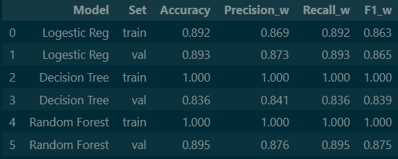

# 🟢 Beginner Track

## ✅ Week 1: Setup, EDA & Feature Engineering

### 🛠️ 1. Project Setup & Data Loading

Q: How did you set up your project environment and manage dependencies?  
- I created a local Python 3.12.6 virtual environment (.venv) in the project folder and selected .\.venv\Scripts\python.exe as the interpreter in VS Code and Jupyter. I installed dependencies with pip install -r requirements.txt and managed package versions using the virtual environment (pip 25.2)

Q: What steps did you take to load and inspect the dataset?  

- I loaded  the dataset bank_full.csv using pd.read_csv() taking look the first 30 rows thorough .head(30)
-  using .shape to confirm the size of df (45211,17)
- I verified the structure with .info() which showed 7 numeric(int64) features, including ( age, balance,day,duration,campaign,pdays,previous) and 10 categorical(object) featires including (job,martial,education, housing , loan,contact,month, poutcome,y)

---

### 📦 2. Data Integrity & Structure

Q: Did you find any missing, duplicate, or incorrectly formatted entries in the dataset?  
- I did not find any missing values using isnull().sum() and additional check for unstructured placehodres(e.g., empty string,"n/a") returend 0 across all 17 column.
- I verified duplicated rows using .duplicated.sum() returened 0 duplicate rows.

- Some categorical variables (e.g., job. education,contact, putcome) included the category 'unknown', which effectively acts as a placeholder for misssing information.

Q: Are all data types appropriate for their features (e.g., numeric, categorical)?  
- Yes, the datatset columns alinged with their expected types:
 -  Numeric(64):
(age, balance, day, duration, campaign,pdays,previous) all sorted as integers with no irregular formatting.
- Categorical(object): 
(job,martial,education, housing , loan,contact,month, poutcome,y) all stored as text labels.

---

### 📊 3. Feature Distribution & Target Assessment

Q: What did you observe about the distributions of key features (e.g., age, balance, campaign)?  
- **Age:** spans 18–95 years. The typical client is around 39 (median ≈ 39) and the average is about 40 (mean ≈ 40).
- Most clients are concentrated in their 30s and 40s, and the number of clients drops at higher ages.

- The age distribution looks close to bell-shaped, but it leans a bit to the right (a small right skew).

- **Balance**: has a very large range, including negative values (overdrafts) and some extremely high positive balances. The median is about 448, while the mean is about 1,360, which suggests the distribution is pulled to the right by a small group of customers with very large balances. High-end outliers are common.

- **Campaign** (number of contacts): ranges from 1 to 63. The median is 2 and the average is about 2.8. Most clients were contacted only 1–3 times, but a small number were contacted many more times, so the distribution is strongly right-skewed with several large outliers.

Q: Is there a class imbalance in the target variable (`y`) 
-  There is a noticeable class imbalance in the target variable y. Around 88% of records are “no”, while only about 12% are “yes.”

- This matters because, during training, a model can become too comfortable predicting “no” most of the time, since that already looks “accurate.”

 How did you check for this? 
 - .value_counts()

Q: What visualizations did you use to summarize your findings?  
- **Histograms** for numeric columns (e.g., age, balance, campaign, duration) to understand the overall shape of each distribution and check for skewness.

- **Boxplots** for balance and duration to quickly spot unusually large or extreme values (outliers).

- A **bar chart** for the target variable y to make the “no” vs “yes” imbalance easy to see.

- **Count plots** for important categorical features such as job, marital, and education to compare how common each category is.

Overall, these visuals helped me understand the numeric distributions, confirm the class imbalance in y, and see which categories appear most often.

---

### 🧰 4. Feature Engineering

Q: What new features did you engineer (e.g., campaign frequency, time since last contact)?  
- built a new yes/no indicator named previously_contacted from the pdays field:

- When pdays is below 999, it suggests the customer had been contacted before, so I set previously_contacted = 1.

- When pdays equals 999, it represents no earlier contact, so I set previously_contacted = 0.

- This turns the original pdays values into something much easier to interpret. I also thought about using campaign together with previously_contacted to capture a broader idea of contact intensity (how frequently the bank tried to reach the customer).Lastly, although duration appeared to be a very strong predictor, I treated it carefully because it is only known after the phone call. Including it in training can create leakage, meaning the model would be using information it wouldn’t have in a real-world prediction setting.
:  
Q: Did you identify any features to exclude or transform?  
- Yes, I decided to leave duration out of training because it is only available after the phone call ends. If I used it, the model would be learning from information that wouldn’t exist at prediction time, which would cause data leakage.

- I also worked with pdays, which had a strong skew because many rows use 999 as a placeholder for “not previously contacted.” To make this easier to interpret, I created a binary feature called previously_contacted (1 = contacted before, 0 = never contacted), and planned to treat the remaining pdays values separately.

- For preprocessing, I identified that all categorical columns (such as job, marital, education, etc.) must be converted into numbers, for example using one-hot encoding. Lastly, I noticed that some numeric variables like balance and campaign are skewed, so I flagged them for possible scaling/normalization during the Week 2 preprocessing step.

Q: How did you address class imbalance (e.g., SMOTE, class weights)?  
- Possible ways to handle the imbalance include oversampling the “yes” class with a method like SMOTE, using class weights in models such as Logistic Regression or Random Forest, and then evaluating and comparing how each approach affects performance (especially recall and precision)

---

## ✅ Week 2: Data Preprocessing & Model Development

---

### 🏷️ 1. Categorical Feature Encoding

Q: Which categorical features did you encode, and what encoding methods did you use (label, one-hot)?  
- I applied pd.get_dummies() only on the training set, and then made sure the validation and test sets matched the training feature space by using:

- VAL/TEST.reindex(columns=TRAIN.columns, fill_value=0)

- Data leakage (using information from val/test when creating training features)

- Column mismatch (when a category appears in one split but not the others)

- I kept the categorical feature list as:
- job, marital, education, default, housing, loan, contact, month, poutcom

Q: What encoding methods did you use (label, one-hot)?
 - numeric features scaled with StandardScaler, categorical features one-hot encoded (sparse_output=False)
 

---

### ⚖️ 2. Numerical Feature Scaling

Q: Which numerical features did you scale, and which scaler did you choose (StandardScaler, MinMaxScaler)? Why?  
- I standardized the numeric variables age, balance, day, campaign, pdays, and previous using StandardScaler from scikit-learn.

- I also removed duration from the feature set because it is only available after a call finishes. Including it would introduce data leakage and make the model look better than it would be in real use.

- I selected StandardScaler for a few reasons:

- It subtracts the mean and divides by the standard deviation, so each scaled feature has an average near 0 and a spread near 1.

- This scaling is a good fit when numeric variables are roughly bell-shaped (or close enough), which applies to many of my inputs after cleaning.

- It can improve performance for models like Logistic Regression that are sensitive to feature scale.

- Compared with MinMaxScaler, it is typically less affected by extreme values, since MinMaxScaler can get stretched a lot when there are big outliers.

 

---

### ✂️ 3. Data Splitting

Q: How did you split the dataset into training, validation, and test sets? What proportions did you use?  
- I split the dataset into three parts using a 70% / 15% / 15% split:

- Training set (70%): used to fit (train) the model

- Validation set (15%): used to choose things like the best threshold and compare models

- Test set (15%): saved for the very end to estimate final performance on unseen data

- I did this in two steps:

- S-plit into TRAIN (70%) and TEMP (30%)

- Split TEMP into VAL (15%) and TEST (15%)

Q: Did you use stratification? Why or why not?  

- Yes, I used stratification based on the target y.
 Because the dataset has class imbalance (many more “no” than “yes”), stratification helps ensure that TRAIN, VAL, and TEST all keep a similar yes/no percentage. Without stratification, one split could accidentally end up with too few “yes” cases, which would make evaluation unreliable

---

### 🤖 4. Model Training & Evaluation

Q: Which baseline models did you train (Logistic Regression, Decision Tree, Random Forest)?  
- Logistic Regression (simple linear baseline)

- Decision Tree Classifier (single tree model)

- Random Forest Classifier (ensemble of many trees)

Q: What metrics did you use to evaluate model performance?  
-  Recall (especially for the “yes” class) - how many real “yes” cases the model successfully finds

- Precision - when the model predicts “yes,” how often it is correct

- F1-score - a single score that balances recall and precision

- Accuracy - overall percent of correct predictions (used mainly for context because the data is imbalanced)

- Confusion matrix (TP, FP, TN, FN) - to clearly see the types of mistakes the model makes

- I also tracked the predicted positive rate (how often the model outputs “yes”), since changing the threshold affects this a lot.
- Why use weighted metrics?
        Because the target classes are not balanced, a weighted average combines the class-wise scores using each class’s share of the data. This gives a more representative single summary number, instead of letting the minority class score dominate or be ignored.
- Evaluation protocol:
    I trained the model using TRAIN only, then reported performance on the validation (VAL) set to approximate how well it generalizes. The TEST set was kept untouched and used only at the very end for the final check.

    ---
    
    key takaaways: 
    Random Forest is the best baseline on validation (highest val accuracy and F1_w), likely because combining many trees improves performance and reduces single-tree instability.

    Logistic Regression is a strong, stable baseline with almost identical train/val results, and it’s easier to interpret.

    Decision Tree shows clear overfitting (perfect training metrics but much lower validation performance), so it needs pruning/tuning to generalize

Q: How did you tune hyperparameters and validate your models?  
- I tuned hyperparameters using GridSearchCV on the training set only, with cross-validation (e.g.,  cv=5). I chose recall as the main scoring metric because the positive class (“yes”) is the minority and missing it (false negatives) is costly.

- My validation process was:

    Fit models on TRAIN (or inside CV folds of TRAIN).

    Pick the best hyperparameters from cross-validation based on highest recall.

    Refit the best model on the full TRAIN set.

    Evaluate on the VAL set (accuracy, precision, recall, F1 + confusion matrix).

    Do a threshold sweep using the cached validation probabilities and lock the best threshold based on the recall/precision trade-off.

    Keep TEST untouched until the very end for the final, unbiased evaluation.

Q: Which model performed best?, and why did you select it?  
 - Random Forest performed best on the validation set because it had the highest validation F1 (weighted) and highest validation accuracy among the three baselines.

 - Stronger overall performance: It produced the best single “summary” results (F1/accuracy) on validation compared with Logistic Regression and Decision Tree.

- More robust than a single tree: Random Forest combines predictions from many trees, which usually makes it less unstable than one Decision Tree and improves generalization.

- Decision Tree overfit: The Decision Tree had perfect training scores (1.00) but noticeably worse validation results, which is a classic sign it memorized the training set.

- Logistic Regression was close and very stable: Logistic Regression had train and validation scores that were very similar (good generalization), but Random Forest still edged it out on validation performance.
---

## ✅ Week 3: Model Experimentation & Tracking

---

### 🧪 1. Experiment Tracking

Q: How did you track your model experiments and results?  
  - Naming each model version clearly (e.g., unweighted vs balanced, tuned vs untuned).

- Saving validation predicted probabilities (“cached probs”) so I could reuse them for threshold sweeps without retraining each time.

- Creating comparison tables on the validation set that included threshold, recall, precision, F1, accuracy, and predicted positive rate for every model.

- Using confusion matrices for each model to understand errors (TP, FP, TN, FN), not just summary metrics.

- Selecting the top models by recall, then running hyperparameter tuning only on those candidates.

- Keeping the test set untouched until the final evaluation step.

Q: What tools or frameworks did you use for experiment tracking (e.g., MLflow)?  
- Jupyter/VS Code notebooks with clearly labeled cells for each model run

- Consistent variable names for saved outputs (e.g., cached validation probabilities and locked thresholds)

- Pandas summary tables to compare metrics across models

- Confusion matrices and plots (ROC/AUC) to document performance visually

- Saved artifacts for deployment (the trained pipeline .pkl and a feature schema .json)

Q: How did experiment tracking help you in comparing different models and hyperparameters?  
- **Easy side-by-side comparison**. I could line up models using the same validation set and compare recall, precision, F1, accuracy, and predicted positive rate in one table.

- **Faster iteration**. By caching validation probabilities, I could do threshold sweeps many times without retraining the model.

- **Better decisions.** Confusion matrices helped me see why one model was better (e.g., fewer false negatives for the “yes” class), not just which had a higher score.

- **Clear model selection**. It made it simple to identify the top candidates (like top 3 by recall), then focus hyperparameter tuning only on those instead of tuning everything. 

---

### 🚀 2. Advanced Model Training

Q: Which advanced models or boosting methods did you experiment with (e.g., XGBoost, LightGBM)?  
- I experimented with several “advanced” tree-based boosting models, including:

    XGBoost (both unweighted and class-balanced versions)

    LightGBM (unweighted, balanced, and also tuned versions)

    CatBoost (unweighted, balanced, and tuned versions)

- For each one, I evaluated on the validation set and also used threshold sweeping to choose a recall/precision trade-off.

Q: What differences did you observe in performance compared to baseline models?  
 - **Higher recall with boosting models**: The best advanced model, LightGBM (balanced), achieved the highest recall (0.704), which is higher than the best baseline recall from Random Forest (~0.665) and much higher than Logistic Regression (balanced 0.628) and Decision Tree (~0.31–0.33).

 - **Trade-off:** lower accuracy when recall improves: The high-recall models (like LightGBM balanced) had lower accuracy (0.777) than some baselines like LogReg (unweighted 0.811), because predicting more “yes” cases increases false positives in an imbalanced dataset.

 - **Decision Tree baseline performed worst:** Even with balancing, the Decision Tree had very low recall (~0.31) and the lowest F1 among the models, showing it did not handle generalization well without tuning.

 - **Random Forest remained a strong baseline but was outperformed on recall:** Random Forest had decent recall (~0.664) and solid accuracy (~0.788), but boosting models (LightGBM/CatBoost) achieved better recall while keeping similar F1.

- **Predicted positive rate increased for high-recall models:** Advanced models that maximized recall predicted “yes” more often (e.g., LightGBM balanced PPR ≈ 0.271) than weaker baselines (Decision Tree PPR ≈ 0.11–0.12), which explains the recall improvement.

Q: How did you handle overfitting or underfitting during experimentation?  
- **Kept a separate validation set:** I evaluated every model on a held-out validation split so the results reflected real generalization, not just performance on the training data.

- **Tracked train vs. validation differences:** I regularly compared training metrics to validation metrics. When I saw models (especially Decision Tree and sometimes Random Forest) scoring perfectly on TRAIN but dropping on VAL, I treated that as a sign of overfitting.

- **Adjusted model complexity with tuning:** For tree-based and boosting models, I tuned key settings (such as max_depth, min_samples_leaf, and class-imbalance options) to control complexity, reduce memorization, and improve minority-class recall.

---

### 🛠️ 3. Hyperparameter Tuning & Validation

Q: What hyperparameter tuning strategies did you use (e.g., GridSearchCV, RandomizedSearchCV)?  
- I used GridSearchCV (scikit-learn) for hyperparameter tuning, but I limited tuning to the strongest candidates from the baseline stage—mainly LightGBM and CatBoost (and in some cases XGBoost) because they produced the best validation recall.

- For each model type, I created a small, targeted parameter grid that focused on the most influential settings. Examples include:

    Logistic Regression: regularization strength (C)

    Tree / ensemble models: tree depth (max_depth), number of trees (n_estimators), and leaf constraints (min_samples_leaf)

    Boosting models: learning_rate, max_depth, num_leaves (LightGBM), and similar key controls

- GridSearchCV then ran cross-validation on the TRAIN split only and selected the parameter combination that gave the best weighted F1 score (used as a single summary metric under class imbalance, while still tracking recall closely).   
- To save time and compute, I did not fully tune models that were weaker in the baseline comparison (for example SVC, Decision Tree, and Logistic Regression), and instead focused resources on the models most likely to be chosen for deployment.

Q: How did you validate your models (e.g., cross-validation)?  
- I validated my models in two levels:

    Holdout validation split: I used a fixed TRAIN / VAL / TEST split (70/15/15). Models were trained on TRAIN and compared on VAL. The TEST set was kept untouched until the final evaluation.

   **Cross-validation during tuning:** When tuning hyperparameters, I used GridSearchCV with k-fold cross-validation (e.g., 5-fold) only on the TRAIN data. This means the training set was split into 5 folds, the model was trained on 4 folds and validated on 1 fold, repeated 5 times, and the average score decided the best hyperparameters.

    **Threshold validation:** After training, I used the VAL set predicted probabilities to sweep thresholds and lock the best threshold based on the recall/precision trade-off.

Q: What were the key hyperparameters that influenced model performance?  
- **Tree-based baselines**

- **Decision Tree / Random Forest**

    max_depth: controls how deep trees can grow (too deep : overfitting- shallower : simpler).

    min_samples_leaf (and min_samples_split): forces leaves to have more samples, which reduces overfitting and can improve generalization.

    n_estimators (Random Forest): number of trees; more trees usually stabilizes results but increases run time.

- **Boosting models**

- **LightGBM / XGBoost / CatBoost**  
    learning_rate: step size of each boosting update (smaller = slower but often better generalization).

    n_estimators / num_boost_round: number of boosting trees; works closely with learning rate.

    max_depth (or depth in CatBoost): complexity of each tree.

    num_leaves (LightGBM): controls model complexity (more leaves = more flexible).
- **Class-imbalance controls**:

    scale_pos_weight (XGBoost/LightGBM) or class_weights (CatBoost) - strongly impacts recall for the “yes” class.
- **Logistic Regression**:
    class_weight: balancing can increase recall on the minority class.

    solver: affects optimization and sometimes performance/stability.

---

### 📈 4. Model Selection & Insights

Q: How did you select the final model for deployment?  
- I chose the final model for deployment by comparing the strongest models on the validation set, prioritizing recall because the main business goal is to catch as many likely subscribers (“yes”) as possible. After evaluating results and running hyperparameter tuning on the best models, LightGBM (balanced) consistently came out on top, showing the strongest recall while remaining stable across repeated runs and checks.

- For deployment, I simplified the Streamlit application to serve only the selected LightGBM (balanced) model. This keeps the app focused, easier to maintain, and closer to a real production workflow, while aligning the final solution with the project objective.

Q: What metrics and business considerations influenced your decision?  
- My decision was mainly guided by recall-first performance and the business cost of missing true subscribers.
- **Metrics that mattered most**

    Recall (for “yes”): the most important metric because the goal is to catch as many potential subscribers as possible. A higher recall means fewer false negatives (missed “yes” clients).

    Precision: I still monitored precision so the model doesn’t flag too many “yes” cases (too many false positives).

    F1-score: used as a balance metric to make sure recall improvements didn’t come with extremely low precision.

    Confusion matrix (TP/FP/TN/FN): especially the FN count, because FN = real subscribers the model failed to identify.

    Predicted positive rate: helped me understand how many customers would be targeted at the chosen threshold (operational impact).

- **Business considerations**
    **Cost of missing a subscriber (FN) is high:** If the model predicts “no” for someone who would actually subscribe, the bank loses a real opportunity.

    **False positives are acceptable up to a limit:** Contacting some extra customers is usually less costly than missing true subscribers, but too many FP wastes marketing effort—so I used threshold locking to control this.

    **Deployment practicality:** I preferred a model that is strong on recall but also stable and efficient to run (LightGBM fits this well).

Q: What insights did you gain from the model experimentation process?  
- Through the experimentation, I noticed that the baseline models were useful as a starting point, but the boosting models (especially LightGBM and CatBoost) handled the imbalance much better and gave stronger recall for the “yes” class. I also learned that getting good results was not only about choosing a model, it depended a lot on tuning key settings and, just as importantly, picking the right decision threshold instead of always using 0.50. Using a separate validation set helped me catch overfitting early and compare models in a fair way, and keeping my results organized made it easier to choose a final model that truly matched the business goal of finding as many likely subscribers as possible without making the system unrealistic to use.
